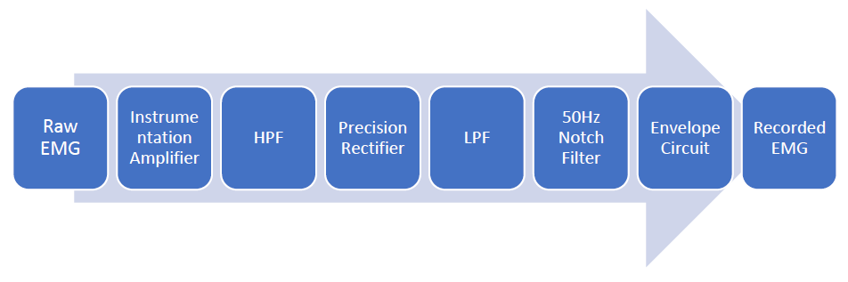
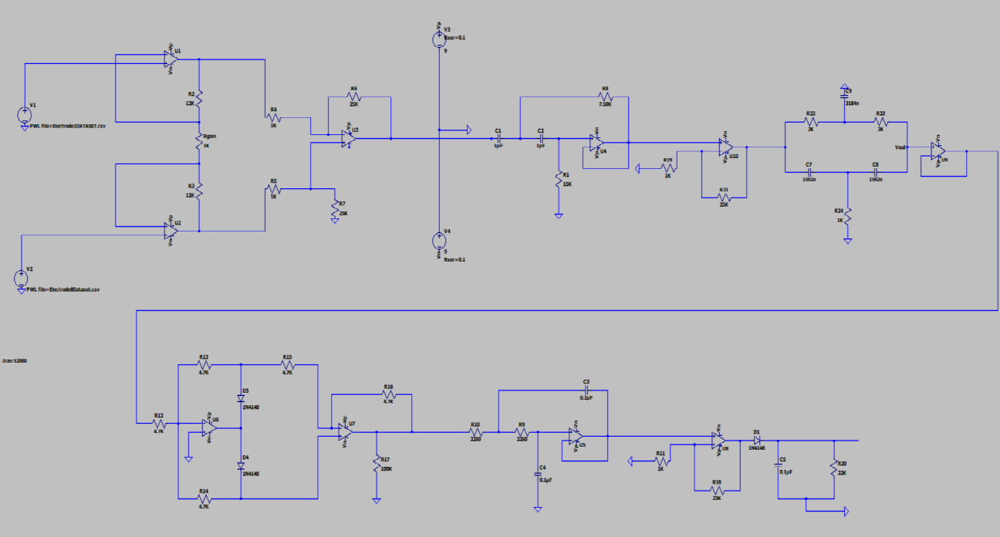
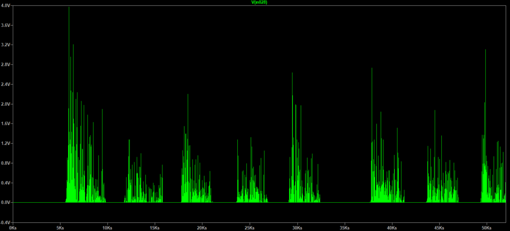
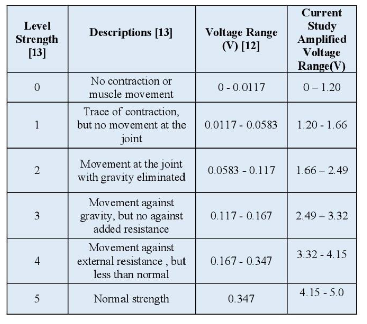
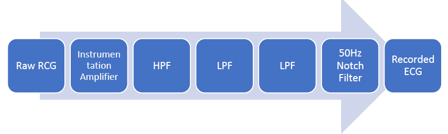
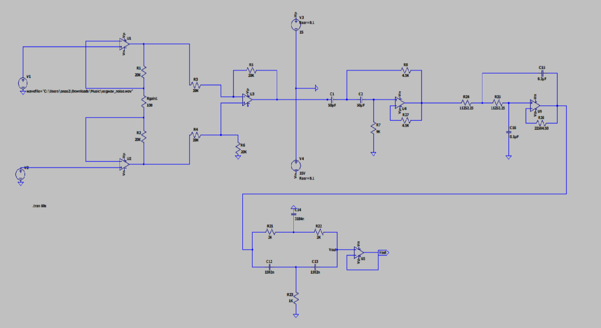
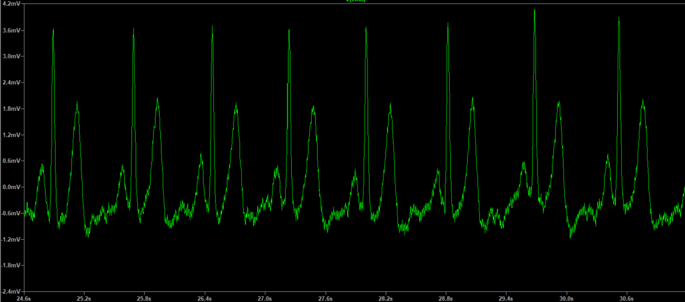

# EMG and ECG Signal Processing

**Course:** EEE 208 - Electronics Circuits II  
**Domains:** Biomedical Engineering, Signal Processing, Analog Circuit Design  

## Project Overview
This project focuses on the design and implementation of analog signal processing systems for Electromyogram (EMG) and Electrocardiography (ECG) applications. The project addresses the challenges of detecting, amplifying, and filtering low-amplitude bio-signals amidst high-frequency noise and external interference.

---

## Part A: Electromyogram (EMG) Signal Processing
EMG detects electrical activity from skeletal muscles. The system was designed to isolate EMG signals from internal/external interference using precise amplification and filtering stages.

* **Proposed Design:** The architectural flow from electrode sensing through amplification to final signal processing.
* **Circuitry:** A specialized analog circuit designed to handle the mV-range myoelectric signals.

| Proposed Design | Circuit Schematic | Output Signal |
| :---: | :---: | :---: |
|  |  |  |

  
*Figure: Summary table of processed EMG output characteristics.*

---

## Part B: Electrocardiography (ECG) Signal Processing
The ECG system processes electrical signals generated by the heart. It specifically targets the removal of 50 Hz power-line interference through notch filtering and signal smoothing via Sallen-Key low-pass filters.

* **Proposed Design:** The design prioritizes signal enhancement to allow for clear observation of cardiac electrical activity.
* **Circuitry:** Integrates a notch filter (center frequency 50 Hz) and a second-order Sallen-Key low-pass filter (cutoff 250 Hz) to eliminate noise.

| Proposed Design | Circuit Schematic | Output Signal |
| :---: | :---: | :---: |
|  |  |  |

---

## Technical Summary
* **Signal Conditioning:** The systems successfully utilized amplification and filtering stages to extract usable bio-signals from raw electrode inputs.
* **Noise Mitigation:** Notch filtering effectively removed 50 Hz power-line interference from the ECG signal, while low-pass filters smoothed out high-frequency noise in the EMG signal.
